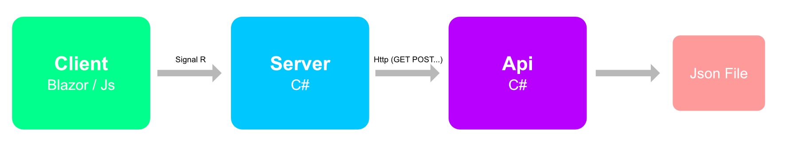

# Architecture du projet

Ce projet est constitué d'une partie serveur et d'une Api utilisant un fichier JJson pour stocker ses données.

La partie serveur est une application Blazor Server et l'API une application .Net 6.