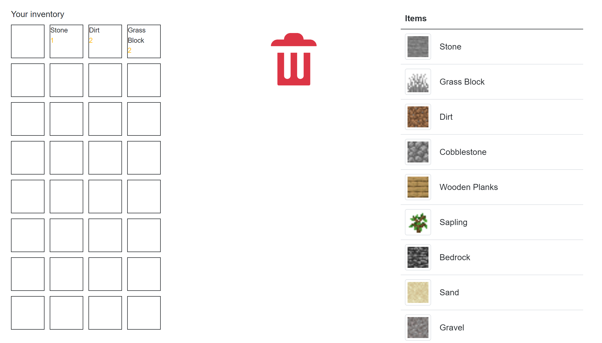

# Page Inventaire



Cette page se décompose en 3 parties :

* La grille d'inventaire
* La poubelle d'items
* La liste de tous les elements

Tous ces éléments sont regroupés dans le composant `InventoryManager`.  

Voici la vue de ce dernier :
```html
<CascadingValue Value="@this">

    <div class="w-100 row" >

        <!-- ========= Left part ========= -->
        <div class="col-md-4">
            <div>@Localizer["your_inventory"]</div>
            <div class="mt-2">
                <div class="css-grid">
                    @{int iItem = 0; }
                    @foreach (var slot in Slots)
                    {
                        <InventoryItem Item="slot.item" Count="slot.count" Index="iItem" />
                        iItem++;
                    }
                </div>
            </div>
        </div>


        <!-- ========= Middle part ========= -->
        <div class="col-md-4 d-flex text-danger justify-content-center">
            <ItemTrash />
        </div>

        <!-- ========= Right part ========= -->

        <div class="col-md-4">
            <DataGrid TItem="Item"
                      Data="@allItems"
                      ReadData="@OnReadData"
                      TotalItems="@totalItem"
                      PageSize="10"
                      ShowPager
                      Responsive>
                <DataGridColumn TItem="Item" Field="@nameof(Item.Id)" Caption="@Localizer["items"]">
                    <DisplayTemplate>
                        <InventoryItem Item="context" type="InventoryItemType.WITH_IMAGE" NoDrop="true" />
                    </DisplayTemplate>
                </DataGridColumn>
            </DataGrid>
        </div>


    </div>

</CascadingValue>
```
---
* La partie inventaire est donc créée simplement avec une boucle sur la list `Slots` du manager.
Cette liste possède des combinaisons 'item' - 'nombre d'item'. Cela permet de mettre à jour la vue facilement en modifiant l'un de ces deux valeurs.
---
* La partie centrale est un second Composant à part entière qui gère simplement la suppression d'un élément drag and drop sur ce drnier.
```C#
    internal void OnDrop()
    {
        Parent.CurrentDragSlot.reset();
    }
```
---
* La dernière partie est une dataGrid avec pagination chargée grace à la methode List de l'api injectée en tant que `IDataService` à la page inventory.
  
```C#
    private async Task OnReadData(DataGridReadDataEventArgs<Item> e)
    {
        if (e.CancellationToken.IsCancellationRequested)
        {
            return;
        }

        if (!e.CancellationToken.IsCancellationRequested)
        {
            allItems = await DataService.List(e.Page, e.PageSize);
            totalItem = await DataService.Count();
        }
    }
```

Tous les sous éléments sont capables de communiquer avec le manager via le paramètre Cascading.


## Le composant InventoryItem

Ce composant contient la plus grande partie de la logique de la page. En effet, il est utilisé à la fois dans l'inventaire et dans la grille de tous les éléments.

Il possède deux formes possibles de rendu (avec ou sans image) et gère la logique de drag and drop des éléments.


```C#
    internal void OnDrop()
    {
        if (NoDrop)
        {
            return;
        }

        if(this.Item == null || this.Item.Equals(Parent.CurrentDragItem))
        {
            // set new values
            if(Item == null)
                this.Count = Parent.CurrentDragSlot.Count;
            else 
                this.Count += Parent.CurrentDragSlot.Count;
            this.Item = Parent.CurrentDragItem;
            StateHasChanged();  // notify view
            Parent.CurrentDragSlot.reset(); // reset last area
            Parent.changeSlot(Index, Count, Item); // notify and save change
        }

        // notify action to be logged
        Parent.Actions.Add(new InventoryAction { Action = "Drop", Item = this.Item, Index = this.Index });

    }

    private void OnDragStart()
    {
        // keep current moving item
        Parent.CurrentDragItem = this.Item;
        Parent.CurrentDragSlot = this;

        // notify action to be logged
        Parent.Actions.Add(new InventoryAction { Action = "Drag Start", Item = this.Item, Index = this.Index });
    }
```


Chaque action est envoyée au manager pour être loggée et chaque changement est notifié afin de mettre  à jour la sauvegarde dans le localStorage.

Cette methode gère également les différents cas suivants :
* drop dans une case avec un item identique : addition des nombres d'items
* drop dans une case vide : déplacement de l'objet
* drop dans une case occupée : rien ne se passe

## Logging

Chaque action dans l'inventaire est loggé. Ceci est réalisé grace à l'injection d'un logger à la construction du manager et grace au nuget `Microsoft.Extensions.Logging.Configuration`.

```C#
    [Inject]
    public ILogger<InventoryManager> _logger { get; set; }
```

## Sauvegarde

La récupération de la sauvegarde est gérée par la page Inventory après le premier rendu :

```C#
    [Inject]
    private ILocalStorageService _localStorage { get; set; }
```
```C#
    protected override async Task OnAfterRenderAsync(bool firstRender)
    {
        var testSave = await _localStorage.GetItemAsync<List<Slot?>>("inventory");
        if (testSave != null)
            Slots = testSave;
        StateHasChanged();
    }
```

Et LocalStorageService est passé en paramètre au manager :

```C#
    [Parameter]
    public ILocalStorageService _localStorage { get; set; }
```
Ceci permet à ce dernier d'effectuer des sauvegardes à chaque notification de changement.

## Globalization et localisation

Cette page gère 2 langes : Français et Anglais.

Le service de localisation est injecté à la page Inventory et passée au manager par Parametre.

```C#
    [Inject]
    private ILocalStorageService _localStorage { get; set; }
```

Cela permet d'y faire  appel  pour réaliser des traductions comme on peut le voir au niveau de l'inventaire :

```html
    <!-- ========= Left part ========= -->
    <div class="col-md-4">
        <div>@Localizer["your_inventory"]</div>
        <div class="mt-2">
            <div class="css-grid">
                @{int iItem = 0; }
                @foreach (var slot in Slots)
                {
                    <InventoryItem Item="slot.item" Count="slot.count" Index="iItem" />
                    iItem++;
                }
            </div>
        </div>
    </div>
```

